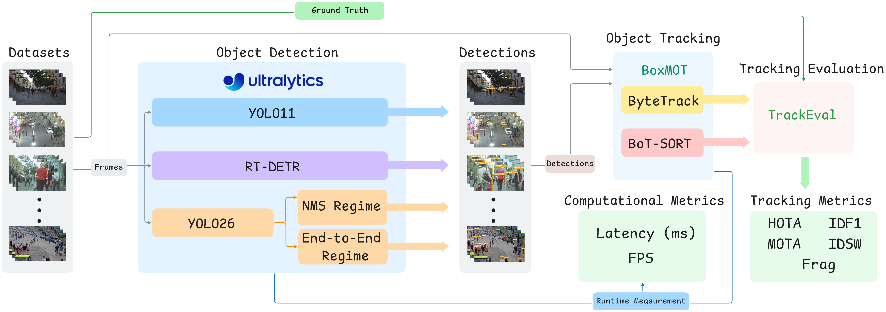

# mot-detectors

Code for the paper *The Impact of Detector Architecture, Model Scale, and Scene Density on
Multi-Pedestrian Tracking*.

It evaluates the YOLO11, RT-DETR and YOLO26 detector families (including a YOLO26
NMS-vs-end-to-end ablation) combined with the ByteTrack and BoT-SORT trackers on MOT17,
MOT20 and SOMPT22, scoring with TrackEval (HOTA, IDF1, MOTA, IDSW, Frag) plus FPS and
latency. The paper's results ship in [`paper_results/`](paper_results/): its 1530 runs in one
table and the tables computed from them. Running the experiments regenerates them (see
[Reproducing the paper](#reproducing-the-paper)).



*Experimental protocol.*

Developed on Windows 11 with an NVIDIA RTX 4070 Ti Super; the code also runs on Linux.

---

## How it works

One YAML file describes one experiment. The `mot.py` CLI expands it into the run grid, runs
each configuration (detect, track, evaluate), writes one `metrics.csv` per run, aggregates
them and computes the tables.

```
mot.py run      experiments/paper_main.yml  ->  results/paper_main/**/metrics.csv
                                                results/paper_main/all_results.csv
mot.py analyze  experiments/paper_main.yml  ->  results/paper_main/tables/*.csv, *.tex
```

```
mot-detectors/
├── mot.py                 # CLI: prepare | run | status | analyze | check | compare
├── core/                  # pipeline package
│   ├── config.py          # YAML to Config; expands the run grid
│   ├── data.py            # prepare/load sequences (GT filtering, density, frames)
│   ├── detect.py          # detector: load, predict, parse (Ultralytics)
│   ├── track.py           # tracker: load, parse outputs (BoxMOT)
│   ├── evaluate.py        # TrackEval integration
│   ├── pipeline.py        # one run: detect, track, evaluate, metrics.csv
│   ├── metrics.py         # timing reconstruction (imread + det + track per frame)
│   ├── runner.py          # resumable batch loop
│   ├── report.py          # aggregate and generate tables
│   └── reproduce.py       # environment check and comparison of two runs
├── experiments/           # YAML experiment definitions
│   ├── paper_main.yml          # the paper's grid: 34 configurations x 9 sequences x 5 runs
│   ├── smoke.yml               # tiny subset for a quick end-to-end check
│   └── paper_environment.json  # the paper's library versions and weight/GT hashes
├── paper_results/         # the paper's runs: all_results.csv (1530 runs) and tables
├── docs/                  # architecture and configuration guides, images/ (protocol figure)
├── tests/                 # unit tests, no GPU needed
├── densities.json         # published density of each sequence
└── requirements.txt       # pinned versions used for the paper
```

[docs/architecture.md](docs/architecture.md) has the module map, the data flow, the design
invariants and the extension points. [docs/configuration.md](docs/configuration.md) is the
full YAML reference.

---

## Installation

### 1. Main environment (Python 3.11)

Windows:

```powershell
git clone https://github.com/Pedro-Manoel/mot-detectors.git
cd mot-detectors
py -3.11 -m venv .venv
.venv\Scripts\activate
pip install torch==2.8.0 torchvision==0.23.0 --index-url https://download.pytorch.org/whl/cu129
pip install -r requirements.txt
```

Linux:

```bash
git clone https://github.com/Pedro-Manoel/mot-detectors.git
cd mot-detectors
python3.11 -m venv .venv
source .venv/bin/activate
pip install torch==2.8.0 torchvision==0.23.0 --index-url https://download.pytorch.org/whl/cu129
pip install -r requirements.txt
```

Install PyTorch first: the PyPI wheel is CPU-only, and `ultralytics` would otherwise pull it
in. `requirements.txt` pins the versions of the environment that produced the paper's
results; the main ones are also recorded in
[experiments/paper_environment.json](experiments/paper_environment.json). On Windows, if
PowerShell refuses to run the activation script, allow local scripts once with
`Set-ExecutionPolicy -Scope CurrentUser RemoteSigned`. On Linux, Python 3.11 and 3.8 must
be installed with their `venv` modules (on Ubuntu, for instance from the deadsnakes PPA),
and minimal images also need the OpenCV system libraries (`libgl1`, `libglib2.0-0`).

### 2. TrackEval (separate environment, Python 3.8)

TrackEval needs its own, older environment and is not part of this repository.

Windows:

```powershell
git clone https://github.com/JonathonLuiten/TrackEval.git
git -C TrackEval checkout 12c8791b303e0a0b50f753af204249e622d0281a
py -3.8 -m venv .venvs\trackeval         # Python 3.8 (3.8.10 for the paper)
.venvs\trackeval\Scripts\pip install numpy==1.23.5 scipy==1.10.1 matplotlib
.venvs\trackeval\Scripts\pip install -e TrackEval\
```

Linux:

```bash
git clone https://github.com/JonathonLuiten/TrackEval.git
git -C TrackEval checkout 12c8791b303e0a0b50f753af204249e622d0281a
python3.8 -m venv .venvs/trackeval
.venvs/trackeval/bin/pip install numpy==1.23.5 scipy==1.10.1 matplotlib
.venvs/trackeval/bin/pip install -e TrackEval/
```

The experiments point to `.venvs/trackeval/Scripts/python.exe`; on Linux the equivalent
`.venvs/trackeval/bin/python` is picked up automatically (`trackeval.python` in the YAML).

### 3. Datasets

The datasets are not redistributed here. Download the **train** splits (they carry the
ground truth) in MOTChallenge format:

- MOT17 and MOT20 from [MOTChallenge](https://motchallenge.net/data/MOT17/)
  ([MOT20](https://motchallenge.net/data/MOT20/));
- SOMPT22 from its [project page](https://sompt22.github.io/).

```
datasets/
├── MOT17/train/MOT17-02-FRCNN/   seqinfo.ini, img1/, gt/gt.txt   (also -04, -05)
├── MOT20/train/MOT20-02/         seqinfo.ini, img1/, gt/gt.txt   (also -03, -05)
└── SOMPT22/train/SOMPT22-07/     seqinfo.ini, img1/, gt/gt.txt   (also -10, -12)
```

MOT17 ships every sequence three times (`-DPM`, `-FRCNN`, `-SDP`) with the same frames and
GT; `prepare` uses the `-FRCNN` copy. `mot.py prepare` filters the GT to pedestrians and puts
the frames in `prepared/`: copies on Windows (about 7 GB for the nine sequences), symbolic
links on Linux.

### 4. Weights

Detector weights download from Ultralytics on first use, into the working directory. To
fetch all twelve up front:

```bash
python -c "from ultralytics import YOLO, RTDETR; [YOLO(f'yolo{v}{s}.pt') for v in ('11', '26') for s in 'nsmlx']; [RTDETR(f'rtdetr-{s}.pt') for s in 'lx']"
```

The BoT-SORT ReID weights `osnet_x0_25_msmt17.pt` download from BoxMOT, or you can place the
file in the repository root. `mot.py check` compares every weight file with the SHA-256 of
the one used for the paper.

---

## Reproducing the paper

```bash
# 0. Environment against the paper's: library versions, CUDA, TrackEval, weight and GT hashes
python mot.py check experiments/paper_main.yml

# 1. Prepare the nine sequences (filtered GT and frames)
python mot.py prepare experiments/paper_main.yml

# 2. Run the full grid into results/paper_main/ (1530 runs)
python mot.py run experiments/paper_main.yml

# 3. Build the tables (no GPU needed)
python mot.py analyze experiments/paper_main.yml

# 4. Compare with the paper's runs
python mot.py compare paper_results results/paper_main
```

`analyze` writes `results/paper_main/tables/`: `quality_bytetrack.tex`, `quality_botsort.tex`
and `efficiency.tex` are Tables II, III and IV of the paper in its LaTeX format, with the best
value of each column in bold, each also as CSV. Quality metrics are expected to match the paper
within run-to-run noise, which the smoke test checks in a few minutes; FPS and latency depend
on the hardware.

**`check`** fails on anything that breaks a reproduction (a missing package, no CUDA,
TrackEval not importable in its environment, a weight file or a prepared GT whose SHA-256
differs from the paper's) and warns on version drift. Run it again after `prepare` and once
the weights are downloaded: it then also verifies the nine filtered GT files, the twelve
detector weights and the ReID weights. The prepared GT is checked independently of line
endings, so Windows and Linux produce the same hashes.

**`compare`** checks a results folder against a reference: the paper's runs in
`paper_results/`, as in step 4, or a run of your own, for instance against a second run
written to another folder with `--name`:

```bash
python mot.py run     experiments/paper_main.yml --name paper_repro
python mot.py analyze experiments/paper_main.yml --name paper_repro
python mot.py compare results/paper_main results/paper_repro
```

It checks every cell of the two quality tables (per-benchmark HOTA, IDF1, MOTA, IDSW and
Frag, both trackers) against tolerances set above the run-to-run noise of the paper's own
data: the largest run-to-run range of a per-benchmark mean is 0.41 HOTA, 0.57 IDF1, 0.13 MOTA,
3 IDSW and 4 Frag, and the tolerances are 0.6, 0.8, 0.6, 4 and 10. It also reports whether
the best-HOTA model of each benchmark is the same. FPS and latency depend on the hardware and
on the timing method (see [Measurement protocol](#measurement-protocol) below), so they are
reported as a ratio, not checked. A partial run (fewer detectors, sequences or benchmarks) is
compared with the reference's rows for the same configurations and sequences only.

The paper's run took about 24 hours on the hardware above; `paper_main.yml` follows the same
measurement protocol, so a full run takes about as long.

### The paper's results (no GPU)

`paper_results/` holds the paper's run: `all_results.csv` has one row per run (1530 rows with
the quality metrics, timing and settings) and `tables/` Tables II to IV as CSV and LaTeX. The
paper's numbers can be checked there without running anything; the tables are rebuilt from
`all_results.csv` with

```bash
python mot.py analyze experiments/paper_main.yml --results paper_results
```

### Smoke test

`experiments/smoke.yml` checks a setup in a few minutes: four configurations (YOLO11-N,
YOLO26-N with NMS and end-to-end, RT-DETR-L) with ByteTrack, one run on MOT17-05, the
smallest sequence (640x480). It goes through the same code as the full grid.

```bash
python mot.py check   experiments/smoke.yml   # environment, weights and GT of this subset
python mot.py run     experiments/smoke.yml   # prepares MOT17-05, writes results/_smoke/
python mot.py analyze experiments/smoke.yml   # quality and efficiency tables
python mot.py compare paper_results results/_smoke   # against the paper's runs on MOT17-05
```

### Resuming

`run` is resumable and crash-safe. `metrics.csv` is written atomically, so a run that exists
is always complete; if the batch is interrupted (Ctrl-C, crash, reboot), re-running the same
command continues from where it stopped. A failure is recorded per detector-sequence group in
`results/<name>/_runs.jsonl` and does not abort the batch; re-running retries the group's
missing runs, and `status` lists a group as failed only until an attempt completes it.

```bash
python mot.py status experiments/paper_main.yml                  # total / done / pending / failed
python mot.py run    experiments/paper_main.yml --force          # re-run everything
python mot.py run    experiments/paper_main.yml --max-frames 20  # fast partial check,
#   always from scratch, in results/paper_main_quicktest/, which never touches canonical results
```

### Measurement protocol

Every experiment measures as the paper did: for each tracker and repetition, one loop reads,
detects and tracks each frame, and the per-frame time `imread + det + track`, from which
`fps_total` is computed, is measured in that loop. Detection therefore runs once per tracker,
and the work a tracker does between frames can slow down the next detection; this is why, in
the paper's runs, BoT-SORT's detection time is higher than ByteTrack's for the same detector
(149 of 153 detector-sequence pairs). Quality (HOTA, IDF1, MOTA, IDSW, Frag) is averaged over
the `runs` repetitions.

Timing runs are not parallelized on the GPU, because contention would corrupt the FPS.

---

## Configuring an experiment

Everything lives in the YAML; [docs/configuration.md](docs/configuration.md) is the full
reference. Adding or removing a sequence is one line under `sequences:`; scales, modes,
trackers, repetitions and thresholds each have their own key. To extend the study with a new
detector, tracker or dataset, see the extension points in
[docs/architecture.md](docs/architecture.md).

```yaml
detectors:
  - { family: yolo11, scales: [n, s, m, l, x], modes: [nms] }
  - { family: rtdetr, scales: [l, x],          modes: [nms] }
  - { family: yolo26, scales: [n, s, m, l, x], modes: [nms, end2end] }
trackers: [bytetrack, botsort]
sequences:                          # the paper's set: 3 per benchmark
  MOT17:   [MOT17-02, MOT17-04, MOT17-05]        #  density  31.0,  45.3,   8.3
  MOT20:   [MOT20-02, MOT20-03, MOT20-05]        #           72.7, 148.3, 226.6
  SOMPT22: [SOMPT22-07, SOMPT22-10, SOMPT22-12]  #           46.0,  57.0,  40.0
```

`paper_main.yml` is the experiment reported in the paper: 17 detector variants (12 detectors,
YOLO26 in both inference modes) and 2 trackers give 34 configurations, each run 5 times on 3
sequences per benchmark (9 in total): 1530 runs, the rows of `paper_results/all_results.csv`.
The densities in the comments are the published values from `densities.json`; they average
28.2 for MOT17, 47.7 for SOMPT22 and 149.2 for MOT20, the three figures quoted in the paper.

---

## Reproducibility notes and caveats

[experiments/paper_environment.json](experiments/paper_environment.json) records the
environment of the paper's run (library versions, TrackEval, and the SHA-256 of the weights
and of the prepared GT), which `check` compares against. The run itself used the pre-refactor
scripts, whose detector, tracker and scoring settings this pipeline keeps. Four points deserve
attention.

**Scoring choice.** TrackEval runs with `do_preproc: false`, and the GT is pre-filtered to
pedestrians at preparation time (`conf==1, class==1`, dropping distractor classes and ignore
regions). The two are coupled: standard MOTChallenge distractor suppression is not applied,
so absolute MOTA and HOTA-DetA are lower bounds and are not directly comparable to the
public MOTChallenge leaderboard. The protocol is uniform, every configuration being scored
identically, so the relative comparisons behind the study's conclusions remain fair. Setting
`do_preproc: true` on the pedestrian-only GT is a no-op, as there is nothing left to suppress;
standard scoring would also require re-preparing the sequences with the full GT.

**Detector and tracker settings.** Every detector runs at `imgsz=640` with `conf=0.25` on
the person class only; NMS-based inference uses `nms_iou=0.7` (the Ultralytics default,
pinned in `detect.NMS_IOU` and irrelevant to the NMS-free heads). Both trackers keep the
BoxMOT defaults (`core/track.py`); the frame rate comes from each sequence's `seqinfo.ini`.
`conf=0.25` truncates the low-confidence second association of ByteTrack (BoxMOT accepts
boxes from `min_conf=0.1`, and the high-score threshold is 0.45) and of BoT-SORT, but it is
the same for all configurations, so the comparisons remain fair.

**Density figure.** Per-sequence densities come from the `densities.json` registry, which
holds the published value of each of the paper's nine sequences (MOT20 averages 149.2 in the
literature against about 127 from the filtered GT). A sequence absent from the registry
raises a warning at `prepare` and falls back to the GT-computed density. Either way the
resolved value and its provenance are written to `meta.json` (`density_avg`,
`density_avg_computed`, `density_registered`), so a fresh clone reproduces the exact density
used and no value is hidden in the code. Density only sets the sparse-to-dense ordering of
the per-benchmark tables (`report.benchmark_order`); it does not enter any quality or
efficiency metric, so the fallback never changes a reported result.

**Determinism.** `cudnn.benchmark=True` is autotuned as in the paper, so detection is not
bit-deterministic: run-to-run HOTA varies by about 0.03 on average, and the tables report the
mean of 5 runs.

---

## Output

`metrics.csv` (one per run) and the aggregated `all_results.csv` carry HOTA/DetA/AssA,
MOTA/MOTP, IDF1/IDR/IDP, IDSW/Frag, Recall/Precision, FP/FN/MT/ML and timing
(`avg_total_ms`, `fps_total`, plus the detect/track/pre/inf/post breakdown).

`mot.py analyze` writes to `results/<name>/tables/` the paper's Tables II to IV, each as `.csv`
and as `.tex` in the paper's format: `quality_{bytetrack,botsort}` (per-benchmark
HOTA/IDF1/MOTA/IDSW/Frag) and `efficiency` (latency and FPS = 1000 / latency, with the
run-to-run std of each).

---

## Citation

If you use this code or the paper's results, please cite:

> P. M. H. Alves, D. C. G. Valadares, and C. de S. Baptista, "The Impact of Detector
> Architecture, Model Scale, and Scene Density on Multi-Pedestrian Tracking," 2026.

## License

MIT License; see [LICENSE](LICENSE).
